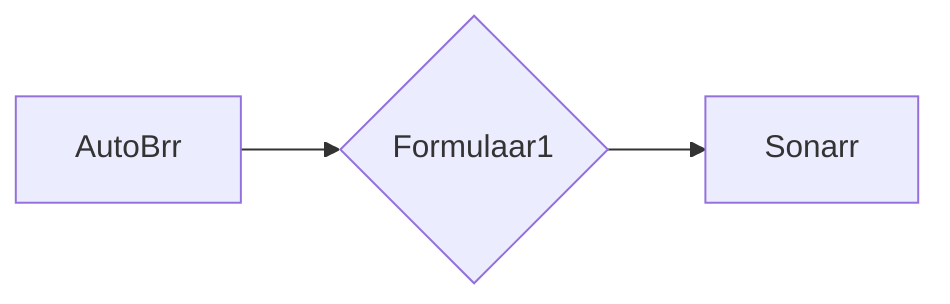

# Formulaar1

[](https://github.com/avassdal/Formulaar1/actions/workflows/ci.yml)

A small tool that automates Formula 1, Formula 2, and Formula 3 release pushes to Sonarr. It intercepts releases from AutoBrr, matches them to the correct TVDB episode, and forwards them to Sonarr with the correct metadata.

Hardlinking is supported on Linux, macOS, and Windows.



## Requirements

- [.NET 10 Runtime](https://dotnet.microsoft.com/en-us/download/dotnet/10.0)
- Sonarr v3
- qBittorrent (with Web UI enabled)

## Install Guide

### Pre-Built Binary

1. Download the latest release from [GitHub Releases](https://github.com/avassdal/Formulaar1/releases).

2. Extract into a folder.

3. Edit `appsettings.json` with your settings:

   ```json
   {
     "TorrentClient": "qBittorrent",
     "Hardlinkpath": "/full/path/to/hardlink/folder",
     "APICredentials": {
       "Sonarr": {
         "ApiKey": "",
         "BasePath": "http://127.0.0.1:8989"
       },
       "qBittorrentClient": {
         "Username": "",
         "Password": "",
         "BasePath": "http://127.0.0.1:10169"
       },
       "bugsnag": {
         "apiKey": "",
         "enabled": false
       }
     }
   }
   ```

   | Setting | Environment Variable | Description |
   | --- | --- | --- |
   | `TorrentClient` | `FORMULAAR1__TorrentClient` | Currently only `qBittorrent` is supported |
   | `EnableHardlinking` | `FORMULAAR1__EnableHardlinking` | `false` (default) — Sonarr handles file management. Set to `true` only if Sonarr cannot reach the qBittorrent download path directly |
   | `Hardlinkpath` | `FORMULAAR1__Hardlinkpath` | Only required when `EnableHardlinking` is `true`. Folder where Formulaar1 creates hardlinks before triggering a Sonarr import |
   | `Sonarr.ApiKey` | `FORMULAAR1__Sonarr__ApiKey` | Found in Sonarr → Settings → General |
   | `Sonarr.BasePath` | `FORMULAAR1__Sonarr__BasePath` | Full URL to your Sonarr instance |
   | `qBittorrentClient.BasePath` | `FORMULAAR1__qBittorrentClient__BasePath` | Full URL to your qBittorrent Web UI |
   | `bugsnag.apiKey` | `FORMULAAR1__bugsnag__apiKey` | Optional — your own Bugsnag project API key for error reporting |
   | `bugsnag.enabled` | `FORMULAAR1__bugsnag__enabled` | Set to `true` if you supply a Bugsnag API key |

4. Start Formulaar1:

   ```sh
   ./Formulaar1
   ```

   You should see output like:

   ```log
   info: Microsoft.Hosting.Lifetime[14]
        Now listening on: http://localhost:5000
   ```

5. In AutoBrr, create a new client with:
   - **Type:** Sonarr
   - **Host:** `http://127.0.0.1:5000` (or whichever port Formulaar1 is listening on)
   - **API Key:** your normal Sonarr API key

   Clicking **Test** should return a green OK.

6. Set up an AutoBrr filter pointing to this new client. That's it!

### GHCR Container Image

Container images are published to `ghcr.io/<owner>/formulaar1` from pushes to the repository default branch and version tags. Replace `<owner>` with the GitHub username or organization that owns the repository you want to pull from.

```sh
docker run --rm -p 5000:5000 \
  -e FORMULAAR1__Sonarr__ApiKey=replace-with-your-sonarr-api-key \
  -e FORMULAAR1__Sonarr__BasePath=http://host.docker.internal:8989 \
  -e FORMULAAR1__qBittorrentClient__BasePath=http://host.docker.internal:10169 \
  ghcr.io/<owner>/formulaar1:latest
```

Set any remaining `FORMULAAR1__...` environment variables as needed for your setup.

### Docker Compose

```yaml
services:
  formulaar1:
    image: ghcr.io/<owner>/formulaar1:latest
    container_name: formulaar1
    ports:
      - "5000:5000"
    environment:
      FORMULAAR1__Sonarr__ApiKey: replace-with-your-sonarr-api-key
      FORMULAAR1__Sonarr__BasePath: http://host.docker.internal:8989
      FORMULAAR1__qBittorrentClient__BasePath: http://host.docker.internal:10169
```

Save the file as `compose.yaml` (or `docker-compose.yml`) and start it with:

```sh
docker compose up -d
```

Add any other `FORMULAAR1__...` environment variables your setup needs, such as hardlinking or qBittorrent credentials, and keep any real API keys or passwords out of version control.

## Supported Series

| Series | TVDB ID |
| --- | --- |
| Formula 1 | 387219 |
| Formula 2 | 392717 |
| Formula 3 | 396724 |

## Circuit/Country Detection

At startup, Formulaar1 fetches the current F1 season calendar from [f1api.dev](https://f1api.dev) to automatically populate circuit and city names for the current year. This means new F1 venues are supported without any code changes.

If the API is unavailable, Formulaar1 falls back to a built-in static dictionary which also covers F2/F3 circuits and common alternate names used in release titles (e.g. `COTA`, `Imola`, `UAE`, `British`).

## Issues

Please raise any issues if you have any problems.
